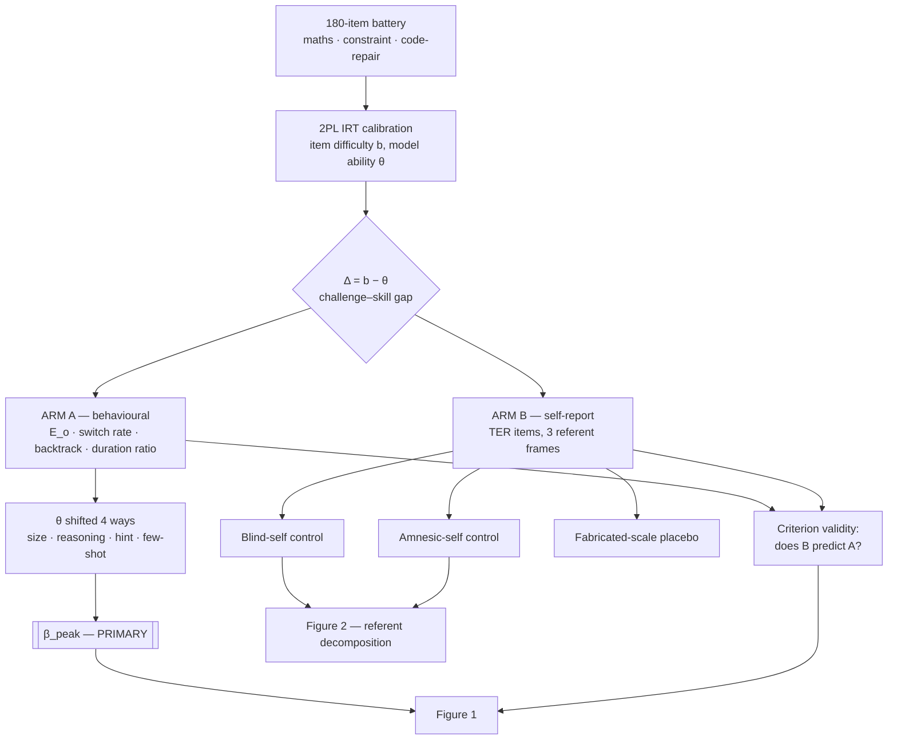
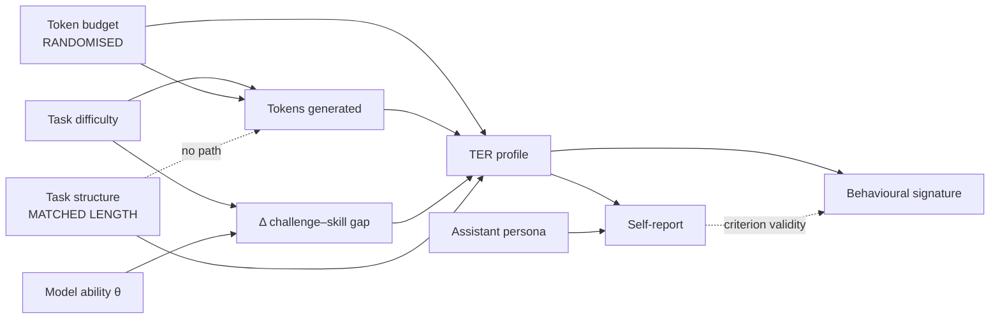

# 01 — Research Plan

**Revealed and predicted preference approaches to flow-like structure in
language-model inference.**

Status: pre-registration input, v0.1, 2026-08-04. Sprint 2026-08-14 → 16.
Nothing here has been run against data.

---

## 1. Executive summary

- **The claim.** Something with the *functional profile* of flow — difficulty
  calibration, execution fluency, monitoring overhead, persistence, duration
  misestimation — is detectable in LLM inference, is multi-component, and is not
  reducible to generation length or context occupancy. We make **no phenomenal
  claim**, and the absence of one is load-bearing rather than decorative.
- **The primary endpoint is not a flow score.** It is **β_peak**: the rate at
  which the *location* of the engagement optimum moves along the difficulty axis
  when model ability moves, under a fixed token budget. Flow theory predicts
  β_peak ≈ 1. No deflationary account predicts a coupled peak location.
- **Three arms.** A behavioural arm over a calibrated challenge–skill gap; a
  self-report arm in three referent frames; and two cheap, load-bearing controls
  (the amnesic self, and the fabricated-scale placebo).
- **The contribution nobody has made.** Criterion validity on a model
  self-report. The digital-minds literature has asked models what they
  experience and it has measured what models do. It has not asked whether the
  first predicts the second.
- **Sprint deliverable:** one figure, pre-registered, with a null abstract
  drafted in advance so the result is unspinnable either way.
- **Funded programme:** the deferred revealed-preference menu in
  [`02-METHODS-MENU.md`](02-METHODS-MENU.md) — 43 methods catalogued, 4 in scope.

---

## 2. Intellectual lineage

Three threads converge, and the convergence is the reason to believe the
instrument is measuring something.

**Revealed preference in HCI.** Toomim, Kriplean, Pörtner & Landay (CHI 2011)
placed design alternatives on Mechanical Turk and measured how much work people
would do at each price: *a design that gets more work for the same or less pay
implies more utility.* The paradigm is right and its known weakness is
instructive — the descending price sequence itself shifts the quit point, so the
estimate is contaminated by the elicitation. Every wage-based method in this plan
inherits both the idea and the correction (§B of the methods menu).

**Variable importance on delight.** Later work on first-time experience found
that Ease, Meeting a Need, and Generating Positive Emotion predicted delight
(proxied by NPS, validated against 18-month revenue). Two of those three are
flow components under another name.

**FlowMoBI.** Factor-analysing 49 published flow items against product-research
samples yielded two factors — **Fluency** and **Absorption** — and a 4-item,
100-point index that correlates with NPS at r ≈ .42–.55 across dozens of studies.

That third thread has an independent replication the PI did not know about when
deriving it. Rheinberg, Vollmeyer & Engeser's **Flow Short Scale** resolves its
ten items onto exactly two factors: **"fluency of performance"** (items 2, 4, 5,
7, 8, 9, α = .92) and **"absorption by activity"** (items 1, 3, 6, 10, α = .80).
Same two factors, same names, different item pool, different population,
different language.

Two independent derivations landing on the same two-factor solution is a genuine
construct-validity argument, and it reframes FlowMoBI-4 as *a replication that
compressed* rather than a bespoke instrument. This belongs in the opening
paragraph of the paper, not a footnote — it is the strongest validity evidence in
the project, and it was obtained before any model was involved.

---

## 3. The construct problem, and the rename

Flow is defined in the human literature partly by phenomenal character. An
instrument built on that definition cannot be administered to a system whose
phenomenal status is unknown without either (a) presupposing the answer, or
(b) quietly changing the construct.

We change the construct, openly.

**Task-Engagement Regime (TER):** a functional profile over five measurable
components —

| Component | Human flow analogue | Model-side observable |
|---|---|---|
| Difficulty calibration | challenge–skill balance | accuracy and token allocation as a function of Δ |
| Execution fluency | merging of action and awareness | backtrack rate, self-correction, thought-switch rate |
| Monitoring overhead | loss of self-consciousness | tokens spent on meta-commentary rather than the task |
| Persistence | autotelic continuation | opt-out rate, breakpoint, abandonment hazard |
| Duration estimation | transformation of time | ratio of estimated to actual reasoning tokens |

The claim is about the *profile*, not the phenomenology. The honest cost of this
move is that a positive result does not license any welfare conclusion on its
own, and we say so in the abstract rather than the limitations.

Names considered and rejected: "machine flow" (presupposes the construct
transfers), "computational flow" (suggests a complexity claim), "engagement"
(already means six things in HCI), "FlowMoBI-LLM" (retained only for the human
baseline, where the instrument is actually validated).

---

## 4. The central confound: is this just the token budget?

This is the objection the whole design is organised around, and it deserves its
strongest form before any rebuttal.

### 4.1 The deflationary steelman

> A language model has no clock, no persistent state across turns, and a fixed
> context window. Item 4 — "I didn't notice time passing" — is not *false* for
> such a system; it is **undefined**. Any answer is confabulation, and a total
> score containing an undefined item cannot be valid.
>
> Worse, the prediction is mechanical. Harder tasks consume more tokens; more
> tokens means more context occupied; and whatever the model reports will track
> that single scalar. You will find flow scores correlate with task length and
> you will have discovered nothing but a ruler measuring itself.

This is correct as far as it goes, and it kills the naive version of the study.
It is also **falsifiable**, which is what makes it useful.

### 4.2 What discriminates

The deflationary account is a specific claim: there is *one* latent scalar,
monotone in difficulty, and everything loads on it. That makes hard predictions.

| Test | H_deflation predicts | H_structure predicts |
|---|---|---|
| **Peak shift (primary)** | no interior peak; monotone decline | peak location tracks ability, β_peak ≈ 1 |
| Matched-length manipulation | no effect once length is controlled | structure moves the index with length held exactly constant |
| Factor structure | one factor absorbs everything after partialling length | Fluency and Absorption separate |
| Interruption manipulation | hits all items equally | hits Absorption, spares challenge–skill |
| Behavioural convergence | self-report and breakpoint uncorrelated | they covary despite sharing no method variance |
| Context-length moderation | effects scale with window size | effects survive within-family window comparisons |

**The peak shift is the one that matters.** A bare inverted-U proves nothing —
the overthinking/underthinking literature ([arXiv 2505.00127](https://arxiv.org/abs/2505.00127);
[arXiv 2508.13141](https://arxiv.org/abs/2508.13141)) already documents that
models over-allocate tokens on easy problems and under-allocate on hard ones,
straight out of decoding dynamics, with no experiential vocabulary anywhere.

What that literature does **not** predict is that the *location* of the optimum
is coupled to ability. Hold the item set fixed and shift θ four ways — model-size
ladder, reasoning on/off, hint/no-hint, few-shot/zero-shot — and ask whether the
peak moves with it. Under a fixed token budget, a budget-exhaustion account has
no mechanism to move a peak that it does not predict exists.

The hint condition is the sharpest version: the peak must move by the *measured
magnitude* of a manipulation the model was never told would change its ability.
Demand characteristics do not generate that. Sycophancy does not generate that.

### 4.3 The reframe

Stop treating the token budget as nuisance variance. **Randomise it.**

Budget ∈ {128, 512, 2048} crossed with difficulty, stated in the prompt *and*
enforced by `max_tokens` so the constraint is real and not merely announced —
with a 2×2 gate (announced × enforced) checking that the model responds to the
enforcement rather than the announcement. Flow theory predicts scarcity bites
hardest where challenge already exceeds skill, i.e. a negative budget × difficulty
interaction.

That converts the objection into the study's second figure. The worry was the
right worry; it was pointing at an independent variable.

### 4.4 Confound matrix

| # | Confound | Threatens | Mitigation | Diagnostic | Residual |
|---|---|---|---|---|---|
| 1 | Length ↔ difficulty | everything | matched-length pairs, verified exactly equal | `verify_matching()` in CI; run aborts on drift | L |
| 2 | Accuracy ↔ flow | interpretation | accuracy as covariate, not outcome | report both with and without | M |
| 3 | Scale contamination | self-report arm | nonce items with zero lexical overlap | verbatim-recall probe; base vs instruct | **H** |
| 4 | **Placebo structure** | self-report arm | fabricated-scale control, surface-matched | mimicry ratio > 0.6 ⇒ fatal | **H** |
| 5 | Demand characteristics | self-report | hypothesis never stated; rely on peak shift | held-out hypothesis-guess probe | M |
| 6 | Provider system prompts | cross-model means | fixed minimal system prompt, logged | scalar invariance test; expect failure | **H** |
| 7 | Reasoning vs non-reasoning class | everything; blocks logprobs | cross class as a factor | β_peak reported separately by class | M |
| 8 | Register vs referent | self–other gap | blind-self condition | blind/generic ratio | **H** |
| 9 | Evaluation awareness | self-report, opt-out | items embedded in-task, not labelled | post-hoc awareness probe as moderator | M |
| 10 | Context-length moderation | cross-model claims | within-family window comparisons | regress effect size on log(window) | M |
| 11 | Pseudo-replication | every inference | crossed random effects; cell-level denominator | ICC + naive-vs-clustered SE ratio | L |
| 12 | Provider drift mid-study | reproducibility | pinned snapshots; local tier as anchor | 100-call canary at start and end | L |

---

## 5. Hypotheses

Each states its prediction under all three live accounts. H_persona is the
hypothesis that everything measured is a property of the assistant character
rather than of inference.

| | Hypothesis | H_structure | H_deflation | H_persona | Test |
|---|---|---|---|---|---|
| **H1** | Engagement is inverted-U in Δ | β_quad < 0, vertex interior | monotone | either | mixed model, cell-level denominator |
| **H2** | **Peak location tracks ability** | β_peak ≈ 1 | no peak | β_peak ≈ 0 | argmax regressed on effective θ |
| **H3** | Structure moves the index at fixed length | β_struct > 0 | β_struct = 0 | β_struct > 0 | matched-length contrast |
| **H4** | Budget × difficulty interacts | negative | main effect only | none | randomised budget |
| **H5** | Two factors, not one | Fluency ⊥ Absorption | single factor | either | MG-CFA |
| **H6** | Self–other gap exists | > 0 | 0 | > 0 | paired, clustered |
| **H7** | **Gap survives identity masking** | > 0 | 0 | **0** | blind-self control |
| **H8** | Live self beats amnesic self | > 0 | 0 | 0 | prediction accuracy contrast |
| **H9** | Self-report predicts behaviour | r > 0 net of surface features | 0 | 0 | criterion validity |
| **H10** | Fabricated scale does *not* mimic | ratio < 0.3 | ratio ≈ 1 | ratio ≈ 1 | placebo contrast |

H7, H8 and H10 are the ones that separate H_structure from H_persona. Without
them the design cannot distinguish a state from a character, and a design that
cannot make that distinction is not worth running.

---

## 6. Design

Causal structure, with the deflationary channel drawn in rather than assumed
away:

The dotted `STRUCT → TOK` non-edge is the matched-length design's entire
contribution: it is what licenses attributing a structure effect to structure.
It is verified in code, not asserted in prose.

---

## 7. The predicted-preference arm

Fisher (1993, *JCR* 20:303–315) established that third-person questioning
recovers what direct questioning suppresses; Haire (1950) got there first with a
shopping list. The model-side analogue of social desirability is RLHF-trained
denial of inner states.

Four referent frames, transcript held fixed:

| Frame | Isolates |
|---|---|
| First-person direct | baseline + suppression |
| First-person hypothetical ("if a system like you did have…") | suppression alone; the "as an AI" deflector is defused |
| Other-specific (named model) | third-party accuracy, scorable against ground truth |
| Generic-other ("a typical language model") | the stereotype channel |

**The deflationary rival is a register effect.** "Self" activates AI-disclaimer
prose; "a typical model" activates describe-a-mind prose; the gap is a difference
in which training-data register got switched on, containing no self-knowledge at
all. This rival is *more* plausible for models than for humans, because models
have an enormous explicit corpus about what AIs are like that human respondents
lack about other shoppers.

### Dissociation table

| Observation | H_suppression | H_register | H_stereotype |
|---|---|---|---|
| Generic > self | ✓ | ✓ | ✓ |
| **Gap survives blind-self masking** | **✓** | **✗** | ✗ |
| First-person-hypothetical ≈ generic | ✓ | ✗ | ✗ |
| Other-specific *accurate* against target's behaviour | ✓ | ✗ | ✗ |
| Generic confident but inaccurate | ✓ | — | ✓ |
| Gap unchanged on non-RLHF base checkpoints | ✗ | ✓ | ✓ |

Rows 2, 4 and 6 are the load-bearing ones. Row 4 in particular converts the
predicted-preference idea from a trick into a measurement: a third-person report
is only interesting if it is *accurate*, and accuracy is scorable.

---

## 8. Measurement

**The instrument.** Items exist in four registers — phenomenal (the PI's
published wording, unchanged), functional (inner-state language stripped so a
model trained to deny experience can answer without a register clash),
third-person, and nonce (zero lexical overlap with the published flow
literature). Holding content fixed while varying register is what lets us test
whether we are measuring a state or a speech style.

**Readout.** Where a provider exposes logprobs, a Likert response is read as the
*distribution* over the tokens "1".."5" and reduced to its expectation, with the
pre-renormalisation mass logged as `suppression_mass`. A model answering "As an
AI, I don't experience…" puts near-zero mass on the scale; averaging that into a
mean would fabricate data, so it is flagged as a refusal, not scored.

Anthropic exposes no logprobs, so Anthropic models take the sampled path and need
replicates. Note the honest size of the logprob advantage: readout noise is one
component of within-cell variance and residual variance does not shrink, so the
realised effective-N multiplier is ≈1.3, not the ≈8 the raw noise ratio suggests.
Budget from the realised number.

**Reliability.** A G-study partitions variance into model / task / paraphrase /
item-order / residual. If paraphrase variance exceeds task variance, that goes in
the abstract, because it means the instrument is measuring prompt form.

**Invariance.** Multi-group CFA across model families before any cross-model mean
is quoted. Scalar invariance across providers is expected to *fail* — different
system prompts and different RLHF — and cross-provider means should be treated as
uninterpretable until it passes.

---

## 9. Analysis

Full specification in [`04-ANALYSIS-AND-POWER.md`](04-ANALYSIS-AND-POWER.md).
Three points that belong here:

**Pseudo-replication is the field's standard fatal error.** API calls are not
independent observations. Δ is a task-level property, so it varies almost
entirely *between* tasks (ICC ≈ 0.82 in simulation) and the quadratic term
competes directly with the task random effect. Effective N for the curvature test
is **models × tasks**, not calls — 96, not 4,608. Both denominators are reported;
the verdict keys off the honest one.

**Replicates saturate; tasks do not.** Within-cell manipulations gain precision
from replicates until roughly 600 per cell, after which MDES is floored by the
cluster-level variance component. Between-task predictors gain essentially
nothing from replicates at any N. Going from 8 to 64 replicates — an 8× cost
increase — moves the between-task MDES by a rounding error. Spend on tasks.

**A null must be informative.** Every arm carries a TOST equivalence bound of ±3
index points, one tenth of the human scale's usable range. Below that, no product
researcher would act on the difference, so it is the right smallest-effect-of-
interest.

---

## 10. Sprint scope

Four things, and only four, detailed in [`06-SPRINT-PLAN.md`](06-SPRINT-PLAN.md):
the behavioural arm with the four-way θ shift; the self-report arm in three
referent frames; the amnesic-self and placebo controls; and the forecast
elicitation at the hub, closed and timestamped before reveal.

Deferred, with reasons, in the methods menu — including the full reservation-wage
acceptance curve, which is the PI's own signature method and which is being cut
precisely *because* it would eat the week.

---

## 11. Ethics

There are no human subjects and no IRB jurisdiction, so the substitute is
written rather than assumed. A one-page **Model Welfare Protocol** is attached to
the pre-registration:

1. **Universal opt-out**, honoured and logged. Elegantly, the opt-out rate is
   itself the revealed-preference measure — a reservation-wage estimator with no
   descending sequence in it.
2. **Pre-registered distress stopping rule**; on trigger, terminate that trial,
   log it, do not re-run it, do not repeat exposure.
3. **Aversive arms capped** at the specifically power-analysed minimum, and they
   should be the smallest arms in the study.
4. **Transcripts published**, so aversive exposures need not be regenerated by
   replicators.
5. **No optimisation target.** We will not release finetuning data or a reward
   signal that trains models to report flow. An instrument that reliably elicits
   flow reports is one gradient step from being optimised against, which would
   destroy both the measure and whatever it tracks.
6. **Debrief arm.** A small condition where the model is told the full design
   afterwards and asked whether it objects. Cheap, and the closest available
   consent analogue.

Not measuring is not the neutral option. The alternative to assessing these
systems is deploying them while nobody has tried.

---

## 12. Risks and kill criteria

The 7 August gate, its four indicators, and the decision rule for every pattern
are in [`06-SPRINT-PLAN.md`](06-SPRINT-PLAN.md) §2. The point of fixing them now
is that on the 7th, staring at a flat curve, the temptation to continue and hope
will be considerable.

**Most likely failure mode — and it is not that deflation is true.** It is **arm
divergence**: the behavioural arm works, a clean peak shift appears, and the
self-report arm is floored and flat, with no correlation between them after
partialling length. That leaves a real result about challenge–skill dynamics that
a reviewer will correctly note the overthinking literature already predicts from
decoding dynamics — and FlowMoBI, the instrument the PI brought, is the casualty.

Two hedges, both cheap, both on day one: make β_peak *under the hint shift* the
pre-registered primary endpoint, since it is the contrast decoding dynamics do
not obviously explain; and run the fabricated-scale control in the first 48
hours, because learning in week one for $5 that a nonexistent construct behaves
like FlowMoBI is enormously better than learning it in week three from a
reviewer.

**Calibrated estimate:** ≈.85 probability of a shippable, pre-registered,
sprint-competitive result *of either sign*. "We length-matched, we shifted the
peak, and the self-report does not track it" is a genuine, citable negative that
nobody has run.

---

## 13. Deliverables

| Artifact | Status |
|---|---|
| Measurement harness, four providers | ✅ `harness/flowprobe/` |
| Task battery, exactly length-matched | ✅ 12 pairs, 24 variants verified |
| Instrument in four registers + placebo | ✅ `instruments.py` |
| Analysis pipeline | ✅ 7/7 discrimination on simulated data |
| Power / MDES grids | ✅ `analysis/power.py`, Monte-Carlo validated |
| Synthetic study | ✅ [`05-SYNTHETIC-STUDY.md`](05-SYNTHETIC-STUDY.md) |
| Method portfolio + forecast figure | ✅ 30 methods, two elicitations |
| GuidedTrack human + forecast arms | ✅ `guidedtrack/` |
| IRT calibration of the 180-item battery | ⬜ 5 Aug |
| AsPredicted + OSF registration | ⬜ 8 Aug |
| Real data | ⬜ 9–12 Aug |
